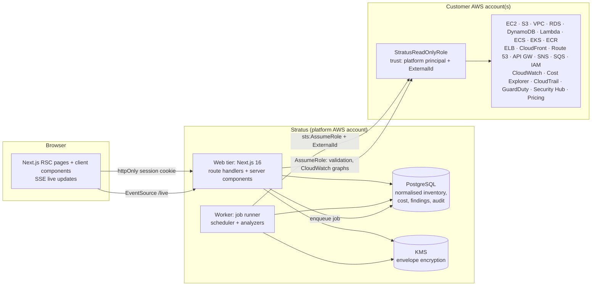

# Stratus — multi-account AWS inventory, cost, security & optimisation

Stratus is a multi-tenant SaaS platform that securely connects AWS accounts through a **read-only
cross-account IAM role** (`sts:AssumeRole` + a unique ExternalId), synchronises a normalised
inventory across every enabled region, and presents dashboards for infrastructure, Cost Explorer
spend, CloudWatch monitoring, security posture, optimisation opportunities, alerts and an
append-only audit trail — updating live as new data arrives. It also ships **guided walkthroughs**
that explain, click by click, how to create and fix things in the AWS console, with the steps
filled in from your own inventory.

**For everyday use:** Simple mode highlights spending and prioritized next steps. The budget planner,
business projects, team help requests, goal-based setup, and weekly summaries make account data
usable without knowing AWS service names. Switch to detailed mode from the sidebar at any time.
Budget warnings and team requests appear in the app; they do not send email or stop AWS spending.
Projects group whole AWS accounts so costs can be attributed without inventing resource-level totals.

Inventory pages support named **saved views** for filters and sort order, plus **Copy view link**.
Views are stored in the current browser, separately for each user, workspace, and inventory page.
Opening a view starts on page one. Shared links require access and the same active workspace.
CSV exports preserve the active inventory filters.

> **Honest data.** Nothing is fabricated. When AWS does not return data (permission denied, service
> not enabled, billing unavailable, no CloudWatch datapoints) the UI says so and explains why.
> Estimates (projections, savings) are labelled as estimates with their basis.

---

## Contents

1. [Architecture](#architecture) · 2. [Local setup](#local-setup) · 3. [Environment variables](#environment-variables) ·
4. [Database](#database) · 5. [Docker](#docker) · 6. [AWS onboarding](#aws-onboarding) ·
7. [Security model](#security-model) · 8. [RBAC](#rbac) · 9. [Data model](#data-model) ·
10. [Real-time updates](#real-time-updates) · 11. [Provisioning](#provisioning-creating-resources) ·
12. [Guided walkthroughs](#guided-walkthroughs) · 13. [Testing](#testing) · 14. [Deployment](#deployment) ·
15. [Troubleshooting](#troubleshooting) · 16. [Known limitations & roadmap](#known-limitations--roadmap)

Further reading: [ARCHITECTURE](docs/ARCHITECTURE.md) · [IAM](docs/IAM.md) · [RBAC](docs/RBAC.md) ·
[THREAT_MODEL](docs/THREAT_MODEL.md) · [DEPLOYMENT](docs/DEPLOYMENT.md) · [BACKUPS](docs/BACKUPS.md) ·
[SECURITY](SECURITY.md)

---

## Architecture



**Pipeline:** AWS APIs → worker collectors (bounded concurrency, full pagination, retries with jitter)
→ normalised inventory in PostgreSQL → security / optimisation / alert analyzers → dashboard APIs →
UI (live-refreshed via Server-Sent Events).

**Layers** (`src/`): `app` (pages, route handlers) · `components` (client-safe UI) · `lib` (client-safe
pure logic: RBAC matrix, cost maths, S3 exposure assessment, topology) · `server/http` (route wrapper:
request id → CSRF → auth → membership/permission → rate limit → Zod) · `server/authz` · `server/services`
· `server/repositories` (always tenant-scoped) · `server/aws` (client factory, STS, collectors,
CloudWatch, Cost Explorer, Price List, fixtures) · `server/rules` (pure security & optimisation
rules) · `server/jobs` + `worker/` · `server/security` (envelope crypto, rate limiting, CSV safety) ·
`server/logging` (redacting logger). Every module in `src/server` imports `server-only`; a lint rule
forbids client code from importing server modules or the AWS SDK.

See [docs/ARCHITECTURE.md](docs/ARCHITECTURE.md) for decisions and trade-offs.

## Local setup

Prerequisites: Node.js ≥ 22 (tested on 24/26), npm ≥ 10, Docker.

```bash
npm ci
cp .env.example .env            # then fill in values (see below)
docker compose up -d postgres   # PostgreSQL 17 on 127.0.0.1:5432 (+ test databases)
npx prisma migrate deploy
npm run dev                     # web: http://localhost:3000
npm run worker:dev              # worker (second terminal): syncs, analyzers, alerts, scheduler
```

Generate local secrets:

```bash
openssl rand -base64 48   # AUTH_SECRET
openssl rand -base64 32   # LOCAL_MASTER_KEY
```

Open http://localhost:3000 → create an account → create a workspace → you land on **Overview** →
*Connect AWS*.

**Without AWS (fixture mode).** Set `AWS_MODE=fixtures` to explore with deterministic synthetic data
(accounts `123456789012`, `210987654321`, `444455556666`; any role named `Stratus…`). Every page shows a
*Fixture mode* banner; fixture mode is rejected when `APP_ENV=production`.

### Using real AWS data locally (single account)

1. Pick a **non-root** IAM identity for the platform (e.g. a CLI profile). Stratus refuses to start
   with root credentials.
2. In `.env`: `AWS_MODE=live`, `AWS_PROFILE=<profile>`, `PLATFORM_AWS_ACCOUNT_ID=<its account>`,
   `PLATFORM_AWS_PRINCIPAL_ARN=<its ARN>` and — only because the platform and monitored account are the
   same — `ALLOW_PLATFORM_ACCOUNT_CONNECTION=true` (never allowed in production).
3. Restart web + worker, run the *Connect AWS* wizard, deploy the generated CloudFormation template
   **as an IAM administrator** in the account, paste the `RoleArn` output and verify.

## Environment variables

All variables are validated at startup (`src/server/env.ts`); the process refuses to start on invalid
or insecure combinations. `.env.example` lists every variable with placeholders.

| Variable | Purpose |
|---|---|
| `APP_ENV` | `development` \| `test` \| `production` — production enforces KMS, live mode, https, no platform-account connection |
| `APP_URL` | Public origin (CSRF origin checks, auth callbacks) |
| `DATABASE_URL` | PostgreSQL connection (use `sslmode=verify-full` in production) |
| `AUTH_SECRET` | ≥ 32 chars; signs sessions |
| `AUTH_GITHUB_*`, `AUTH_GOOGLE_*` | Optional OAuth providers |
| `AUTH_REQUIRE_EMAIL_VERIFICATION` | Require verified email before sign-in |
| `ENCRYPTION_PROVIDER` | `local` (dev) \| `kms` (required in production) |
| `LOCAL_MASTER_KEY` / `KMS_KEY_ID`, `KMS_REGION` | Envelope-encryption key material |
| `AWS_MODE` | `live` \| `fixtures` |
| `PLATFORM_AWS_ACCOUNT_ID`, `PLATFORM_AWS_PRINCIPAL_ARN` | The platform identity customers trust (verified at startup) |
| `PLATFORM_AWS_REGION` | Region for STS/global calls |
| `AWS_PROFILE` | Local development only: CLI profile for the platform identity |
| `ALLOW_PLATFORM_ACCOUNT_CONNECTION` | Single-account self-hosting only; rejected in production |
| `ALLOW_ACCESS_KEY_CONNECTIONS` | Development-only access-key connections (off by default) |
| `WORKER_CONCURRENCY`, `WORKER_POLL_INTERVAL_MS`, `WORKER_HEALTH_PORT` | Worker tuning / health endpoint |
| `AWS_REGION_CONCURRENCY`, `AWS_SERVICE_CONCURRENCY` | Bounded AWS fan-out |
| `SCHEDULED_SYNC_INTERVAL_MINUTES` | Automatic inventory refresh (0 disables); cost refresh runs every 12 h |
| `TRUSTED_PROXY_HOPS` | Proxies in front of the app (client-IP derivation for rate limits) |
| `LOG_LEVEL` | `debug` \| `info` \| `warn` \| `error` |

## Database

PostgreSQL + Prisma 7 (`prisma/schema.prisma`, migrations in `prisma/migrations`). Hand-written SQL in
migrations adds what Prisma cannot express: a trigram index for global search, a **partial unique
index allowing one active job per account and type** (duplicate syncs are impossible), composite
foreign keys that keep child rows in their account's tenant, CHECK constraints, and **triggers that
make `audit_logs` append-only** (UPDATE/DELETE/TRUNCATE rejected).

```bash
npx prisma migrate deploy    # apply
npx prisma migrate status    # verify
```

## Docker

```bash
docker compose up -d postgres                  # local database
docker build --target runtime -t stratus .     # production image (web by default)
docker run --env-file .env -p 3000:3000 stratus
docker run --env-file .env stratus node dist/worker.mjs
docker build --target migrate -t stratus-migrate . && docker run --env-file .env stratus-migrate
```

The image contains no secrets, runs as the unprivileged `node` user, and includes production
dependencies only. `docker compose --profile app up` runs web + worker together locally.

## AWS onboarding

**Settings → Cloud accounts → Connect AWS** (Admin/Owner):

1. Enter the AWS account ID and a display name → Stratus creates a pending connection with a fresh
   **ExternalId** (32 random bytes, encrypted at rest).
2. Deploy the generated **CloudFormation template** (download or copy), or follow the manual IAM steps
   (trust policy, read-only policy, deny policy, CLI commands).
3. Paste the role ARN → Stratus validates the ARN, calls `sts:AssumeRole` with the ExternalId,
   verifies the account with `sts:GetCallerIdentity`, discovers enabled regions and runs per-service
   **permission diagnostics** (showing the exact missing IAM action for any denied capability).
4. The connection is saved (never the temporary credentials) and the first inventory + cost sync
   starts automatically; you land on the Overview, which fills in live.

Statuses: *Connected*, *Needs attention* (optional capability denied), *Permission problem* (required
permission denied), *Connection failed*, *Role unavailable* (role deleted / trust changed).

**Why an ExternalId?** It prevents the *confused deputy* problem: another Stratus customer who learns
your role ARN cannot make Stratus assume it, because they would need your connection's unguessable
ExternalId, which only Stratus generates. See
[AWS guidance](https://docs.aws.amazon.com/IAM/latest/UserGuide/id_roles_common-scenarios_third-party.html).

**IAM policy.** The complete permission list with the reason for each action, the explicit
data-plane deny list, and the optional separate action role are documented in
[docs/IAM.md](docs/IAM.md) (generated from code). The role never needs `AdministratorAccess`.

## Security model

- **Credentials never reach the browser, logs, DB, cache, URLs or images.** STS credentials exist only
  in a non-serialisable in-memory session object for the duration of one job/request.
- **Tenant isolation** via a single authorization guard (`authorizeOrg`) and tenant-scoped repositories;
  cross-tenant ids return 404; composite FKs enforce tenancy in the database.
- **Envelope encryption** (AES-256-GCM, KMS-wrapped data keys, AAD bound to tenant + row) for
  ExternalIds and optional access keys.
- **Hardened HTTP:** per-request CSP nonce with `strict-dynamic`, HSTS, `X-Frame-Options: DENY`,
  `nosniff`, restrictive Permissions-Policy; Origin-checked JSON-only mutations (CSRF); strict Zod
  schemas (unknown keys rejected — mass assignment); prototype-pollution-safe JSON parsing; body limits.
- **Rate limits** (PostgreSQL-backed, multi-instance safe) on auth, connection validation, manual sync,
  exports, metrics, search and all APIs.
- **Sanitised errors** with correlation IDs; redacting structured logs; append-only audit trail.
- **SSRF:** no user-controlled URLs are fetched; AWS endpoints come only from an allow-listed region.

Details: [docs/THREAT_MODEL.md](docs/THREAT_MODEL.md), [SECURITY.md](SECURITY.md).

## RBAC

Owner · Admin · Operator · Viewer · Billing Viewer · Security Viewer. Full matrix in
[docs/RBAC.md](docs/RBAC.md) (generated from `src/lib/rbac.ts`).

## Data model

`User`, `Session`, `Account`, `TwoFactor` (Better Auth) · `Organization`, `OrganizationMember`,
`Invitation` · `AwsAccount`, `AwsConnection` · `AwsResource`, `ResourceTag`, `MetricSummary` ·
`CostRecord` · `SecurityFinding`, `OptimizationFinding` · `AlertRule`, `Alert` · `AuditLog` ·
`SyncJob` · `ActionRequest` · `RateLimitBucket`. All tenant tables carry `organizationId`; UUID keys;
`createdAt`/`updatedAt`; raw AWS responses are never stored — only allow-listed normalised attributes
(e.g. Lambda environment variables are reduced to a count, RDS master usernames are dropped).

## Real-time updates

- Each workspace page subscribes to `/api/v1/orgs/{id}/live` (Server-Sent Events). When the data
  version or job state changes (sync progress, new inventory/cost/findings/alerts) the page re-renders
  in place; the top bar shows **Live / Syncing…** and a live alert count.
- **Refresh now** (Overview) queues a sync for every account; inventory also refreshes automatically
  every `SCHEDULED_SYNC_INTERVAL_MINUTES` (default 15 locally / 360 in the template) and cost data every
  12 h (Cost Explorer itself updates roughly daily and bills each request).
- CloudWatch graphs refresh every 60 s (server-cached for 5 min).
- Inventory is as fresh as the last sync — Stratus polls AWS APIs; it does not yet consume EventBridge
  change events (roadmap).

## Provisioning (creating resources)

Stratus can create a small, fixed set of resources in a connected account. This is opt-in per
connection, uses a **second IAM role** (`StratusProvisionerRole-<connectionId>`) with its own
ExternalId, and never touches the read-only role.

| Service | What it creates | Fixed secure defaults |
| --- | --- | --- |
| `ec2` | One Linux instance | Amazon Linux 2023, encrypted gp3, IMDSv2 required, approved instance types |
| `s3` | One bucket | Block Public Access on, SSE-S3, ACLs disabled, versioning, name scoped to the connection |
| `vpc` | One VPC | Private RFC 1918 range only, DNS enabled, **no** internet gateway, NAT or routes |
| `subnet` | One subnet | Inside its VPC, non-overlapping, auto-assign public IPv4 permanently off |

Every creation goes plan → review → typed confirmation → apply, with the plan hashed so the thing
you confirm is the thing that gets built. Each apply re-checks permissions, the connection and the
guardrails immediately before the first mutating call, runs an AWS dry-run first, and verifies the
created resource against the approved plan afterwards.

**Networks are refused, not just warned about, when:** the range is public address space, it is
outside /16-/28, it is a host address rather than a network, it overlaps an existing VPC or a
sibling subnet, the subnet falls outside its VPC's range, or the VPC belongs to another account.
Overlapping ranges are rejected because they cannot be peered or reached by VPN afterwards, and
neither a VPC's primary CIDR nor a subnet's range can be changed once created.

What the provisioner role **cannot** do, by policy: delete anything, create or attach internet
gateways or NAT gateways, add routes, modify subnet attributes, peer VPCs, or `iam:PassRole`. A
network Stratus creates is private until someone deliberately opens it in the AWS console.

> **Upgrading an existing connection.** VPC and subnet support added new IAM actions. Connections
> that deployed the provisioner stack earlier must download the template again and update the
> stack, or network creation fails with an AWS permission error.

---

## Guided walkthroughs

`/guides` holds click-by-click runbooks for the AWS console: where each screen is
(`Console → EC2 → Instances → Launch instances`), which button to press, what to type into each
field and **why that value**, what it costs, how to check it worked and how to undo it.

Four categories:

| Category | Covers |
| --- | --- |
| Launch compute | Launching an EC2 instance with encrypted storage, IMDSv2 required and no public IP |
| Storage and databases | A private, encrypted, versioned S3 bucket; an encrypted, private RDS instance with backups |
| Networking basics | A VPC with public/private subnets and correct routing; a security group that references groups rather than CIDRs |
| Fix a finding | One walkthrough per security rule Stratus can raise, linked from the finding itself |

Two properties make these more than static documentation:

- **They use your resources.** `{{vpcId}}`, `{{subnetId}}`, `{{securityGroupId}}` and `{{region}}`
  are resolved from the workspace's own synchronised inventory
  (`src/server/services/walkthrough-service.ts`), so the steps name real ids. When a value is not
  available the token renders as a visible hint — a plausible-looking fake id is never invented.
  The suggested security group is deliberately one that is *not* open to the internet.
- **They are linked from findings.** Every finding shows "Show me exactly where to click", opening
  the matching walkthrough with that finding's region and resource id already applied. A unit test
  reads `security-rules.ts` and fails if a rule is added without a walkthrough.

Console deep links are built by an allow-list (`src/lib/walkthroughs/console.ts`): the region is
validated against the same catalogue the SDK uses and resource ids must match a known shape, so a
link can never be pointed at a non-AWS host.

Stratus itself performs none of these changes from this page — it holds a read-only role. Real
provisioning is a separate, opt-in feature with its own role and a typed confirmation.

---

## Testing

```bash
npm run check:source       # self-review gate (control chars, any, console, TODO, key literals, …)
npm run lint && npm run typecheck
npm test                   # unit tests (no network; AWS SDK mocked with aws-sdk-client-mock)
npm run test:integration   # against the real PostgreSQL test DB, through real route handlers
npm run test:e2e           # Playwright: production build + real worker, fixture AWS world
npm audit --audit-level=high
```

Latest local results: **unit + integration: 32 files / 244 tests passing; E2E: 5 passing
(stable across repeated runs); `npm audit`: 0 vulnerabilities; production build and Docker image build
succeed.** Tests cover tenant isolation (every resource type), IDOR, RBAC escalation, CSRF, XSS rendering,
SQL-injection and prototype-pollution payloads, credential non-persistence (full DB scans), log
redaction, STS failure modes, ExternalId/account substitution, pagination, partial region failure,
queue dedupe/leases/fencing, rate limits, exports, alerts and live streams.

## Deployment

AWS reference deployment (ECS Fargate web + worker, RDS PostgreSQL, KMS, Secrets Manager, ALB +
CloudFront + WAF, VPC endpoints): see [docs/DEPLOYMENT.md](docs/DEPLOYMENT.md). Backups, RPO/RTO and
restore testing: [docs/BACKUPS.md](docs/BACKUPS.md). CI (`.github/workflows/ci.yml`) runs gitleaks,
`npm audit`, the source gate, lint, typecheck, unit, integration, build, E2E and a Trivy image scan.

## Troubleshooting

| Symptom | Cause / fix |
|---|---|
| Server refuses to start: *Invalid environment configuration* | Message lists the variable names; see table above |
| *Platform AWS credentials belong to the ROOT user* | Use a dedicated IAM user/role profile (`AWS_PROFILE`) |
| *AWS role could not be assumed* | Role missing, trust policy principal wrong, or ExternalId not copied exactly |
| *The role belongs to a different AWS account* | The ARN's account must match the declared account ID |
| *This AWS account cannot be connected* | You are connecting the platform's own account; for single-account local use set `ALLOW_PLATFORM_ACCOUNT_CONNECTION=true` |
| *Missing required AWS permission: X* | Update the role with the policy from the wizard / `docs/IAM.md`, then *Re-validate* |
| *Billing data is not available: Cost Explorer is not enabled for IAM access* | An **account-level** setting, not an IAM policy problem — AWS returns `AccessDeniedException: User not enabled for cost explorer access` even when the role allows `ce:GetCostAndUsage`. As the **root user**: Billing and Cost Management → Cost Explorer → enable, and Account → *IAM user and role access to Billing information* → Activate. Allow up to 24 h for the first data, then press *Refresh cost data*. |
| *Billing data is not available: missing required AWS permission* | The role really is missing `ce:GetCostAndUsage` — update it from the wizard and re-validate |
| Sync *partially completed* | One region/service failed or was throttled; other data is kept; check the account's sync details |
| Nothing updates | Is the worker running? `curl 127.0.0.1:3199/healthz` (with `WORKER_HEALTH_PORT=3199`) |
| Support request | Quote the `ref:` / `requestId` shown with errors — it correlates to server logs |

## Known limitations & roadmap

The new [Operations workspace](docs/OPERATIONS.md) implements first versions of all 20 product
ideas, including resource history, ownership, drift, incidents, shared views, reviewed actions,
one-time shutdown/start schedules, email notifications, and provisioning templates.

Product ideas and suggested priorities: [Feature roadmap](docs/FEATURE_ROADMAP.md).

- Polling-based inventory (scheduled + manual); EventBridge/Config change streams would give
  near-instant updates.
- Alert delivery supports in-app and SMTP email subscriptions from Operations. Slack/webhooks are not implemented.
- MFA is available per user but not yet enforceable per workspace; SSO/SAML not implemented.
- Resource pages offer lifecycle/configuration controls. Operations adds a separate reviewed-action
  workflow with action mode disabled by default, a separate role, and second-person approval.
- Provisioning creates one resource per plan. It does not create internet gateways, NAT gateways,
  routes or route-table associations, so a new VPC has no internet path until you add one yourself
  (the networking walkthrough covers this). Deletion is never offered.
- Guided walkthroughs describe the AWS console as of the date they were written. AWS redesigns it
  periodically, so a control may move; steps name what to search for as well as where it was. They
  are not automatically checked against the live console.
- AWS Resource Explorer is not used; global search uses Stratus's own synchronised index.
- Savings estimates use public on-demand list prices (no Savings Plans/RI/EDP awareness) and CPU
  only for rightsizing (no memory without the CloudWatch agent).
- The production image is large (~3.8 GB, full AWS SDK + Next.js); a standalone/tree-shaken build
  would reduce it.
- Row-level security in PostgreSQL would add a second tenant-isolation layer.

GCP and Azure setup, supported capabilities, and verification limits: [Multi-cloud connections](docs/MULTICLOUD.md).
