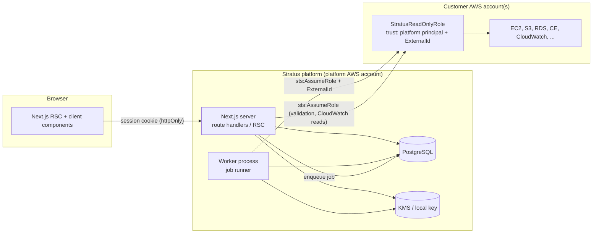
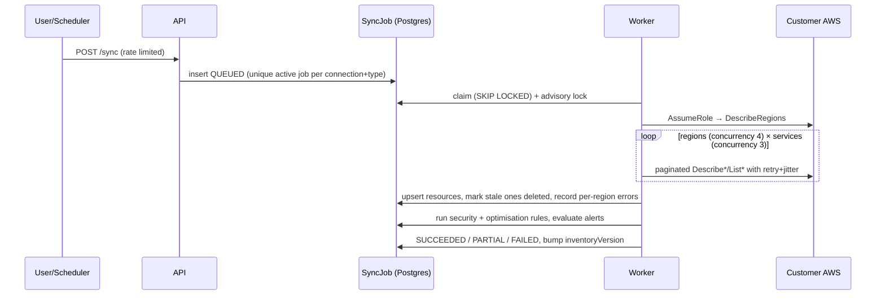

# Stratus — Architecture & Repository Plan

Stratus is a multi-tenant AWS cloud-management and FinOps platform. It connects customer AWS
accounts through **cross-account IAM roles assumed with STS + a per-connection ExternalId**,
synchronises a normalised inventory into PostgreSQL, and serves dashboards, cost analytics,
security posture and optimisation findings from that inventory.

## 1. Guiding principles

1. **Credentials never leave the server process.** Temporary STS credentials live only inside the
   AWS SDK client objects created for a single job/request and are dropped when it ends. Nothing
   credential-shaped is ever serialised to the DB, logs, cache, API responses or the browser.
2. **Tenant isolation is enforced in one place.** Every server entry point goes through
   `requireOrgPermission()` which verifies *authentication → membership → permission*, and every
   repository query takes an `organizationId` that is part of the `WHERE` clause. Resource lookups
   are always `(organizationId, id)` pairs — never `id` alone.
3. **Read-only by default.** The generated IAM role is read-only. Action mode requires a second,
   separately-deployed role and an explicit org-level toggle.
4. **Inventory, not live fan-out.** Pages read PostgreSQL. AWS is called by background jobs
   (bounded concurrency, retries with jitter, full pagination), plus a few cached on-demand reads
   (CloudWatch graphs).
5. **Honest data.** If AWS did not return data, the UI says "unavailable" with the reason. No
   synthetic metrics outside the explicitly-labelled fixture mode used for tests/local demos.

## 2. System context



## 3. Layering

| Layer | Location | Responsibility | May import |
|---|---|---|---|
| UI | `src/app`, `src/components` | Rendering, client interactivity | `src/lib` (client-safe), server via RSC only |
| HTTP boundary | `src/server/http` | Route wrapper: request ID, auth, CSRF origin check, rate limit, Zod validation, error sanitisation | services, authz |
| Authorization | `src/server/authz` | Role→permission matrix, `requireOrgPermission` | repositories |
| Services (domain) | `src/server/services` | Business rules (connections, sync orchestration, cost analytics, findings) | repositories, aws gateway, security |
| Repositories | `src/server/repositories` | Prisma queries, always tenant-scoped | db |
| AWS adapters | `src/server/aws` | SDK client factory, STS, paginated collectors, retry/concurrency | security (redaction) |
| Rules engines | `src/server/rules` | Pure functions: security & optimisation rules over normalised inventory | nothing server-specific |
| Jobs | `src/server/jobs`, `src/worker` | Postgres-backed queue, advisory-lock dedupe, handlers | services |
| Cross-cutting | `src/server/{env,logging,security,cache,observability}` | env validation, logger+redaction, crypto, rate limit, cache, metrics | — |

`server-only` is imported by every module under `src/server`, so any accidental import from a
client component fails the build.

## 4. Key decisions

| Topic | Decision | Rationale |
|---|---|---|
| Auth | **Better Auth** (email/password, optional GitHub/Google OAuth, `twoFactor` plugin for TOTP MFA, DB sessions) | Mature, self-hosted, DB-backed revocable sessions, built-in auth rate limiting. Orgs/RBAC are implemented in-app so the tenant model is under our control. |
| ORM | Prisma 7 + `@prisma/adapter-pg` | Parameterised queries, typed models, migrations. |
| Queue | Postgres `SyncJob` table + `FOR UPDATE SKIP LOCKED` claim + `pg_try_advisory_xact_lock` + partial unique index on active jobs | No extra infra; dedupe guaranteed by the DB. Redis/SQS can replace it behind the `JobQueue` interface. |
| Rate limiting | Postgres fixed-window counters (`RateLimitBucket`) | Correct across multiple app instances. |
| Cache | In-process TTL cache; keys = `org:{id}:v{inventoryVersion}:...` | `inventoryVersion` bump after each sync invalidates across all instances without pub/sub. |
| Secrets at rest | Envelope encryption (AES-256-GCM data key, wrapped by KMS in prod, by a local master key in dev) | Used for ExternalIds and (optional) access-key secrets. |
| AWS mocking | `AwsGateway` interface; real SDK implementation + fixture implementation (`AWS_MODE=fixtures`, forbidden when `APP_ENV=production`) | Unit tests use `aws-sdk-client-mock` against real adapters; E2E uses fixtures through the full stack. |
| Logging | Small in-house JSON logger with mandatory recursive redaction | Avoids transport/bundling issues; redaction cannot be bypassed. |
| CSP | Per-request nonce set in `proxy.ts`, `strict-dynamic`; `style-src 'unsafe-inline'` (Radix/Recharts inline styles) | Blocks injected scripts; documented trade-off for styles. |
| Outbound webhooks | **Not implemented**; channel interface only | User-supplied URLs are an SSRF vector — requires an egress proxy with allowlist before enabling (see THREAT_MODEL). |

## 5. AWS connection model

1. Admin starts the wizard → server creates an `AwsConnection` in `PENDING` state with a
   32-byte CSPRNG ExternalId (encrypted at rest) and the **expected AWS account ID**.
2. The wizard renders a CloudFormation template (generated server-side, principal = platform
   account/role from env, ExternalId condition, read-only managed + inline policies) or manual steps.
3. Admin submits the Role ARN → Zod + ARN parser validates partition/account/role name; account must
   equal the expected account and must **not** be the platform's own account.
4. `sts:AssumeRole` (ExternalId, 15-min session, session name `stratus-{connId}`) →
   `sts:GetCallerIdentity` → account must match again.
5. Diagnostics: one cheap read per capability (EC2, S3, CE, CloudWatch, …), each mapped to
   `OK | DENIED | ERROR` + the missing IAM action.
6. Persist status + diagnostics. Credentials go out of scope.

## 6. Sync pipeline



## 7. Repository layout

```
.
├── prisma/                 schema.prisma, migrations, seed
├── src/
│   ├── app/                Next.js App Router (auth), (app) groups, api/
│   ├── components/         ui/ (shadcn), layout/, charts/, data-table/, feature folders
│   ├── lib/                client-safe utils (formatting, types, constants)
│   ├── server/
│   │   ├── env.ts          zod env validation
│   │   ├── db.ts           Prisma client
│   │   ├── auth/           Better Auth config + session helpers
│   │   ├── authz/          RBAC matrix + guards
│   │   ├── http/           route wrapper, errors, CSRF
│   │   ├── logging/        logger + redaction
│   │   ├── security/       crypto/envelope, rate limit, csv safety
│   │   ├── aws/            gateway, sdk adapters, fixtures, retry, pagination, regions, iam templates
│   │   ├── repositories/   tenant-scoped data access
│   │   ├── services/       domain services
│   │   ├── rules/          security + optimisation rule engines (pure)
│   │   ├── jobs/           queue + handlers
│   │   └── cache/          tenant-scoped cache
│   ├── worker/             worker entry point
│   └── proxy.ts            CSP nonce + headers
├── tests/                  unit/, integration/, e2e/, fixtures/
├── docs/                   ARCHITECTURE, THREAT_MODEL, DEPLOYMENT, IAM, BACKUPS, RBAC
├── infra/                  cloudformation (customer role, action role), deployment notes
├── Dockerfile, docker-compose.yml, .env.example, .github/workflows/ci.yml
```

## 8. Phase plan

| Phase | Scope | Gate |
|---|---|---|
| 1 | Scaffold, env, logging/redaction, Prisma schema, Better Auth, orgs, RBAC, HTTP wrapper, headers | lint, typecheck, unit+integration, build |
| 2 | ExternalId, envelope crypto, CFN template, AssumeRole validation, diagnostics, wizard | + STS mocks, cross-tenant tests |
| 3 | Gateway, retry/pagination/concurrency, regions, job queue, worker, sync engine | + pagination/dedupe tests |
| 4 | EC2, S3, VPC collectors + pages + topology | |
| 5 | Dashboard | |
| 6 | Cost Explorer sync + /cost | |
| 7 | CloudWatch on-demand + cache | |
| 8 | RDS/DynamoDB, Lambda, ECS/EKS/ECR, ELB, CloudFront, Route53, API GW, SNS/SQS, IAM metadata | |
| 9 | Security Center rules + GuardDuty/Security Hub | |
| 10 | Optimisation engine | |
| 11 | Alerts, audit log UI, CSV exports | |
| 12 | Hardening, adversarial tests, perf | |
| 13 | Docker, CI, docs, deployment | full E2E + audit |
