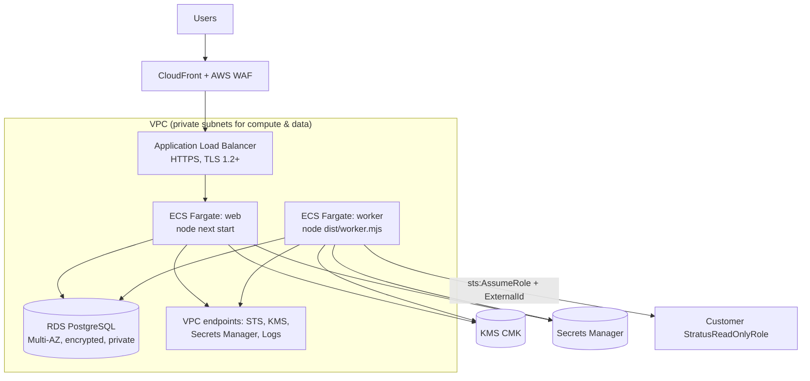

# Production deployment (AWS)

## Reference architecture

## Steps

1. **Network.** VPC with public subnets (ALB, NAT) and private subnets (ECS tasks, RDS). RDS must
   not be publicly accessible; its security group allows 5432 only from the task security groups.
2. **Database.** RDS PostgreSQL 16/17, Multi-AZ, storage encryption (KMS), automated backups
   (≥ 14 days), deletion protection, `rds.force_ssl=1`. Use a dedicated application user that is
   not the table owner and has no `TRUNCATE`/`DELETE` on `audit_logs` (triggers also block it).
   `DATABASE_URL` must use `sslmode=verify-full` with the RDS CA bundle.
3. **KMS.** A customer-managed key for envelope encryption (`ENCRYPTION_PROVIDER=kms`,
   `KMS_KEY_ID`, `KMS_REGION`). Key policy: only the web/worker task roles may `GenerateDataKey`
   and `Decrypt`, with condition `kms:EncryptionContext:app = stratus`. Enable key rotation.
4. **Secrets.** Store `AUTH_SECRET`, `DATABASE_URL` and OAuth client secrets in Secrets Manager and
   inject them through the ECS task definition `secrets` field.
5. **Image.** `docker build --target runtime -t stratus .` → push to ECR (scan on push enabled).
   Run migrations as a one-off task: `docker build --target migrate` (or run `npx prisma migrate deploy`)
   before each release.
6. **ECS services.**
   - web: `CMD` default, port 3000 behind the ALB; ≥ 2 tasks across AZs.
   - worker: command `["node","dist/worker.mjs"]`, `WORKER_HEALTH_PORT=3199` for container health
     checks; scale horizontally (jobs are claimed with `SKIP LOCKED`, leases + fencing prevent
     duplicate work).
   - Both run as non-root with a read-only root filesystem where possible.
7. **Platform IAM role** (task role): only the permissions listed in `docs/IAM.md` →
   *Platform IAM role*. Set `PLATFORM_AWS_ACCOUNT_ID` and `PLATFORM_AWS_PRINCIPAL_ARN` to this role;
   the app verifies its own identity at startup and refuses root credentials.
8. **Edge.** ALB HTTPS listener (ACM certificate, redirect 80→443); CloudFront + AWS WAF managed
   rule groups (Core, Known Bad Inputs, IP reputation) and a rate-based rule. Set
   `TRUSTED_PROXY_HOPS` to the number of proxies that append `X-Forwarded-For` (ALB only: 1;
   CloudFront → ALB: 2) so client IPs used for auth rate limiting cannot be spoofed.
9. **Environment.** `APP_ENV=production` (enforces: KMS encryption, live AWS mode, https `APP_URL`,
   no platform-account connection, no placeholder secrets), `APP_URL=https://…`.
10. **Observability.** Container logs are structured JSON → CloudWatch Logs (set retention).
    Create metric filters/alarms on `level=error`, `"audit write failed"`, `"worker loop error"`,
    and job failure rates; the in-process metrics registry maps directly to OpenTelemetry
    instruments for later export.

## Vercel

The web tier can run on Vercel, but the worker is a long-running process and needs a separate
runtime (ECS/Fargate, Fly, a VM). The database must be reachable privately (e.g. Vercel Secure
Compute) and the platform identity must come from OIDC-federated AWS credentials, never static keys.

## Release checklist

- `npm run check:source && npm run lint && npm run typecheck && npm test && npm run test:integration && npm run build && npm run test:e2e`
- `npm audit --audit-level=high`, image scan clean
- migrations applied before new tasks start
- verify `/sign-in` health, worker `/healthz`, and a test connection's diagnostics
